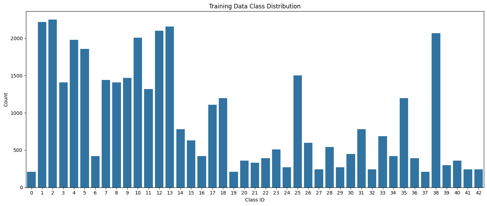
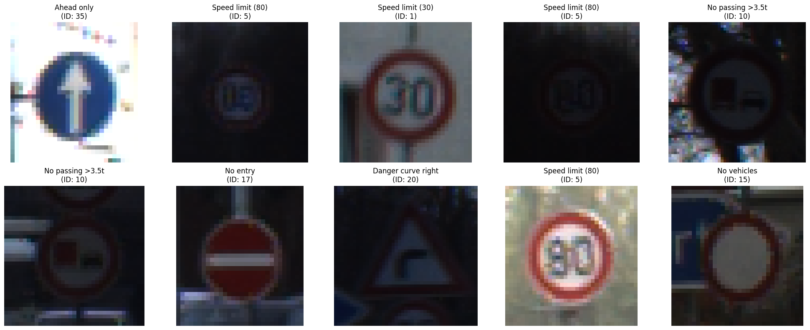
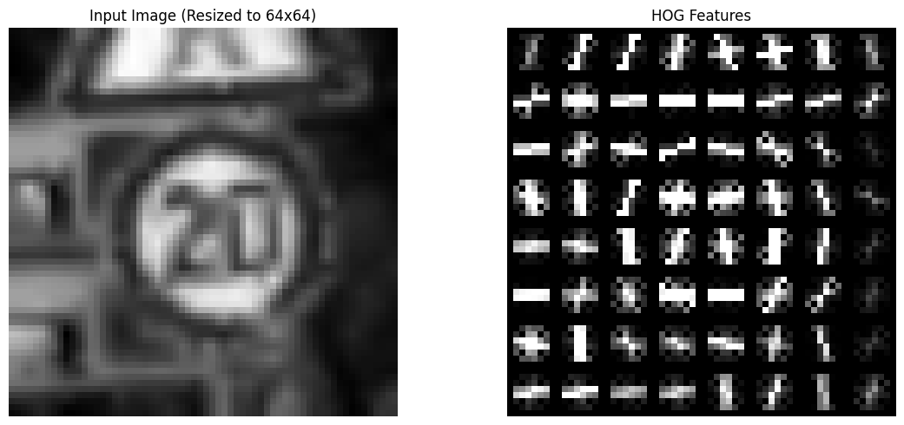
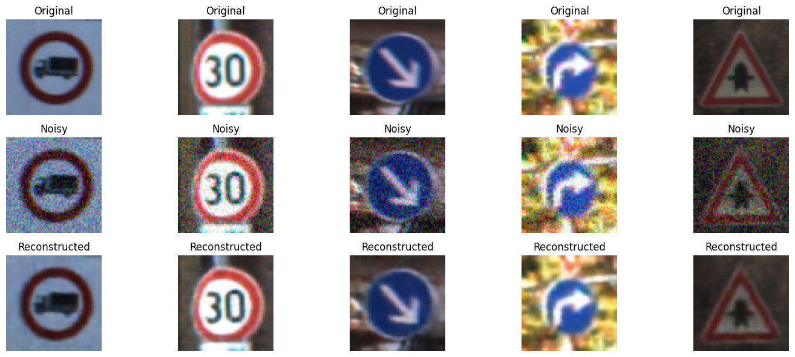

# Autonomous Vehicle Perception Module

A comprehensive comparative study of traffic sign recognition using traditional machine learning and deep learning approaches. This project implements and evaluates multiple classification strategies across two phases using the GTSRB (German Traffic Sign Recognition Benchmark) dataset.

## Table of Contents
- [Project Overview](#project-overview)
- [Dataset](#dataset)
- [Phase 1: Traditional Machine Learning](#phase-1-traditional-machine-learning)
- [Phase 2: Deep Learning](#phase-2-deep-learning)
- [Conclusion](#conclusion)

---

## Project Overview

This project explores traffic sign classification through two distinct approaches:

1. **Phase 1**: Classical computer vision with hand-crafted features (HOG) and traditional ML algorithms
2. **Phase 2**: Deep neural networks including custom CNNs, transfer learning, and autoencoders

**Key Statistics:**
- Dataset: GTSRB (43 traffic sign classes)
- Training Images: ~39,209
- Test Images: ~12,630
- Input Resolutions: 64×64 (CNN/AE), 224×224 (Transfer Learning)

---

## Dataset

### Class Distribution Analysis


- Most common class: Speed limit (50) - highest representation
- Least common class: Varies by class, balanced using stratified split
- Training/Validation Split: 80/20 (stratified)

**Preprocessing:**
- Lazy loading using custom PyTorch Dataset class
- Normalization: ImageNet statistics (mean=[0.485, 0.456, 0.406], std=[0.229, 0.224, 0.225])
- Sample images visualization:



---

## Phase 1: Traditional Machine Learning

### Methodology

#### 1. Feature Extraction: Histogram of Oriented Gradients (HOG)
HOG captures edge and texture patterns in traffic signs effectively.

**HOG Parameters:**
- Orientations: 8
- Pixels per cell: 8×8
- Cells per block: 1×1
- Feature vector dimension: 64 (after extraction)



#### 2. Dimensionality Reduction: PCA
Applied PCA to compress HOG features while retaining classification power.

**PCA Trade-off Analysis:**
| Config | Features | Val Accuracy | Test Accuracy | Compression |
|--------|----------|--------------|---------------|-------------|
| 32 components | 32 | 0.9250 | 0.6023 | 93.75% |
| 64 components | 64 | 0.9495 | 0.6474 | 87.50% |
| 128 components | 128 | 0.9603 | 0.6846 | 75.00% |
| 256 components | 256 | 0.9626 | 0.7017 | 50.00% |
| Raw (No PCA) | 512 | 0.9580 | 0.6973 | None |

**Selected Config:** 128 PCA components (optimal balance between speed and accuracy)

### Models Trained

#### **Model 1: Naive Bayes (Baseline)**
- **Type:** Probabilistic classifier
- **Configuration:** Gaussian NB with var_smoothing tuning
- **Parameters:** Hyperparameter-tuned via GridSearchCV

**Baseline Performance (Raw Features):**
- Validation Accuracy: 0.8049
- Test Accuracy: 0.7451
- Validation AUC-ROC: 0.9921
- Test AUC-ROC: 0.9849

#### **Model 2: K-Nearest Neighbors (Baseline)**
- **Type:** Instance-based classifier
- **Configuration:** k=5, Euclidean distance
- **Parameters:** Hyperparameter-tuned (n_neighbors=[3-10], metrics=['euclidean', 'manhattan'])

**Baseline Performance (Raw Features):**
- Validation Accuracy: 0.9580
- Test Accuracy: 0.6973
- Validation AUC-ROC: 0.9967
- Test AUC-ROC: 0.9019

### Hyperparameter Tuning (GridSearchCV)

Both Naive Bayes and KNN were tuned with GridSearchCV on PCA-reduced features:

| Model | Search Space | Best Parameters | Best CV Accuracy | Validation Accuracy | Validation AUC-ROC |
|-------|--------------|-----------------|------------------|---------------------|--------------------|
| Naive Bayes | `var_smoothing` in `logspace(0, -9, 100)` | `{'var_smoothing': 1.873817422860383e-05}` | 0.8440 | 0.8460 | 0.9948 |
| KNN | `n_neighbors` = 3..10, `metric` in {euclidean, manhattan} | `{'metric': 'euclidean', 'n_neighbors': 3}` | 0.9525 | 0.9651 | 0.9956 |

#### **Model 3: Random Forest**
- **Type:** Ensemble learning
- **Configuration:** 100 decision trees
- **Hyperparameters:** Default scikit-learn settings

**Performance (PCA 128):**
- Validation Accuracy: 0.8674
- Test Accuracy: 0.7086
- Validation AUC-ROC: 0.9951
- Test AUC-ROC: 0.9730

#### **Model 4: XGBoost**
- **Type:** Gradient boosting
- **Configuration:** 100 estimators, depth=6, learning_rate=0.1
- **Hyperparameters:** Tuned for multi-class classification

**Performance (PCA 128):**
- Validation Accuracy: 0.8884
- Test Accuracy: 0.7683
- Validation AUC-ROC: 0.9977
- Test AUC-ROC: 0.9883

## Phase 2: Deep Learning

### Model 1: SimpleCNN (Custom 2-Layer CNN)

**Architecture:**
```
Input (64×64, RGB)
  ↓
Conv2d(3→16, 3×3) + ReLU + MaxPool(2×2)
  ↓
Conv2d(16→32, 3×3) + ReLU + MaxPool(2×2)
  ↓
Flatten → FC(32×16×16→128) + ReLU
  ↓
FC(128→43)  [Output]
```

**Training Configuration:**
- Epochs: 5
- Batch Size: 64
- Optimizer: Adam / SGD
- Scheduler: StepLR / CosineAnnealing

**Results Comparison:**

| Optimizer | Scheduler | LR | Val Acc | Test Acc |
|-----------|-----------|-----|---------|----------|
| Adam | StepLR | 1e-3 | 0.980745 | 0.902771 |
| SGD | CosineAnnealing | 5e-3 | 0.979980 | 0.890420 |


### Model 2: Transfer Learning (Two-Phase Training)

**Backbones Evaluated:**
- MobileNetV2 (Lightweight, ~3.5M parameters)
- VGG16 (Heavy, ~138M parameters)

#### **Training Strategy: Head-First Fine-Tuning**

```
Phase 1: Head Training (2 epochs)
├─ Freeze: Entire backbone
├─ Trainable: Classifier head only
├─ Learning Rate: 1e-3 (aggressive)
└─ Goal: Stabilize new output layer on task data

Phase 2: Fine-tuning (3 epochs)
├─ Freeze: Lower backbone layers
├─ Unfreeze: Top 4 (MobileNet) / Top 10 (VGG) layers + classifier
├─ Learning Rate: 1e-4 (conservative)
└─ Goal: Adapt pretrained features to traffic signs
```

**Why Head-First Approach?**
- Prevents degradation of pretrained features
- Noisy random head gradients won't corrupt backbone early
- Classifier stabilization ensures meaningful fine-tuning signals
- Mimics curriculum learning: easy → hard

#### **Transfer Learning Results**

| Base Model | Val Acc | Test Acc | Time (s) | Size |
|-----------|---------|----------|----------|------|
| MobileNetV2 | 0.985208 | 0.908076 | 465.442013 | 14 MB |
| VGG16 | 0.996685 | 0.948535 | 710.121168 | 528 MB |


### Model 3: Denoising Autoencoder

**Purpose:** Learn robust features and reconstruct noisy images

**Architecture:**

```
Encoder:
Input (64×64, RGB)
  ↓
Conv(3→32, K=3) + BN + ReLU + MaxPool(2×2)
  ↓
Conv(32→64, K=3) + BN + ReLU + MaxPool(2×2)
  ↓
Conv(64→128, K=3) + BN + ReLU
  ↓ [Bottleneck - 128×16×16]

Decoder:
ConvTranspose(128→64, K=2, S=2) + BN + ReLU
  ↓
ConvTranspose(64→32, K=2, S=2) + BN + ReLU
  ↓
Conv(32→3, K=3) + Sigmoid
  ↓
Output (64×64, RGB)
```

**Training Configuration:**
- Epochs: 15
- Batch Size: 64
- Noise Factor: 0.1 (10% random Gaussian noise during training)
- Optimizer: Adam (LR=5e-4)
- Loss: L1 (MAE) for robustness

**Reconstruction Performance:**

| Split | MAE | MSE |
|-------|-----|-----|
| Validation (best epoch) | 0.0210 | 0.0010 |
| Test | 0.0209 | 0.0010 |



---

## Technical Stack

**Languages & Frameworks:**
- Python 3.8+
- PyTorch 2.0+
- TorchVision
- scikit-learn, XGBoost, scikit-image
- NumPy, Pandas, Matplotlib

**Hardware Used:**
- GPU: NVIDIA T4 / Colab GPU
- Compute: ~2-3 hours total training time
- Memory: 16 GB RAM, 16 GB VRAM

**Optimizations Implemented:**
- CUDA acceleration (cudnn.benchmark, TF32)
- Mixed precision training (torch.autocast + GradScaler)
- Multi-worker DataLoaders (8 workers, persistent)
- Non-blocking GPU transfers
- Batch prefetching (prefetch_factor=2)

---

## Conclusion

This project successfully demonstrates the **effectiveness of transfer learning** for traffic sign classification, achieving **94.85% test accuracy** (VGG16) on the saved run. The comparative analysis reveals:

1. **Deep learning outperforms traditional ML** by about 18.02 percentage points on test set (94.85% vs 76.83%)
2. **Transfer learning is highly efficient**, converging in just 5 epochs
3. **Modern GPU optimizations are essential** for practical training speed
4. **Model selection depends on constraints:** accuracy vs. interpretability vs. deployment resources

The modular approach allows practitioners to choose the best solution for their specific use case, from resource-constrained edge devices (MobileNetV2) to high-accuracy systems (VGG16).

---

## File Structure

```
Autonomous-Vehicle-Perception-Module/
├── Phase1.ipynb          # Traditional ML (HOG + classical algorithms)
├── phase2.ipynb          # Deep Learning (CNN, Transfer Learning, AE)
├── README.md             # This file
└── Charts/               # Graphs and images
```

---

## References

- GTSRB Dataset: https://benchmark.ini.rub.de/gtsrb_dataset.html
- PyTorch Mixed Precision: https://pytorch.org/docs/stable/amp.html
- MobileNetV2: https://arxiv.org/abs/1801.04381
- Transfer Learning: https://cs231n.github.io/transfer-learning/

---
**Authors:** Abdullah Ali,Mohammed Ashraf,Ayman Sayed,Islam Waleed, Ali Kelany
